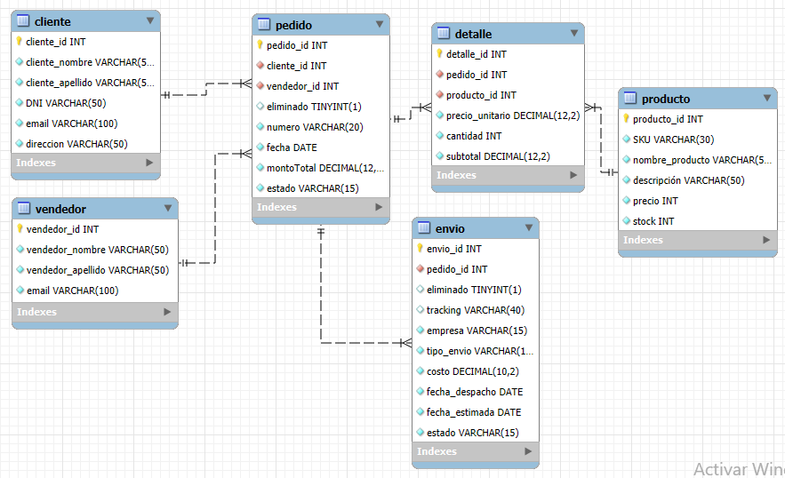

# Retail Bookstore Database Management

**Relational Database Design | SQL | MySQL**



---

## Project Overview

This project presents the design and implementation of a relational database for a retail bookstore. The solution supports the core business operations of a bookstore, including customer management, inventory control, suppliers, purchases and sales.

The database was designed following relational database best practices, ensuring data integrity, consistency and efficient query performance.

---

## Business Problem

Retail bookstores require an integrated information system capable of managing inventory, customer records, suppliers and sales transactions while maintaining data consistency and minimizing redundancy.

This project addresses these challenges by designing and implementing a normalized relational database capable of supporting daily business operations through efficient data management.

---

## Project Objectives

- Design a normalized relational database (Third Normal Form).
- Model business entities and their relationships.
- Ensure data integrity through constraints.
- Optimize query performance using indexes.
- Simplify data retrieval with SQL views.
- Automate database operations using stored procedures.
- Manage user permissions and database security.
- Demonstrate transaction management and concurrency control.

---

## Database Features

- Relational Database Design
- Third Normal Form (3NF)
- Primary and Foreign Keys
- Integrity Constraints
- SQL Views
- Indexes
- Stored Procedures
- User & Permission Management
- Transaction Management
- Concurrency Control

---

## SQL Components

The repository includes:

- Database schema creation
- Sample data loading
- SQL queries
- SQL views
- Index creation
- Integrity constraints
- Stored procedures
- User and permission management
- Transaction management examples

---
## Java Integration

The project includes a Java example demonstrating secure database connectivity using JDBC.

The application illustrates:

- Secure database connection
- Prepared Statements
- SQL Injection prevention
- Parameterized queries
- Secure INSERT operations
- Auto-generated key retrieval

---

## Technologies

- MySQL
- SQL
- MySQL Workbench

---

## Repository Structure

```text
retail-bookstore-database-management/
│
├── database/
│   ├── 01_schema.sql
│   ├── 02_data_load.sql
│   ├── 03_indexes_views.sql
│   ├── 04_security.sql
│   ├── 05_stored_procedures.sql
│   ├── 06_constraints.sql
│   ├── 07_transaction_session_A.sql
│   ├── 08_transaction_session_B.sql
│   └── 09_advanced_procedures.sql
│
├── images/
│   └── entity_relationship_diagram.png
│
├── reports/
│   └── Database_Project_Report.pdf
│
├── README.md
├── LICENSE
└── .gitignore
```

---

## Skills Demonstrated

- Relational Database Design
- Database Normalization
- SQL Programming
- Query Optimization
- Database Security
- Stored Procedures
- SQL Views
- Indexing
- Transaction Management
- Concurrency Control

---

## Author

**Jorgelina Etchevest**

Economist | Business & Data Analyst

**Technical Skills**

Python • SQL • Tableau • Power BI • Machine Learning • Database Design • Business Analytics
